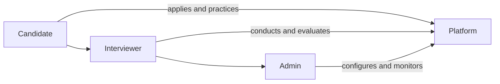
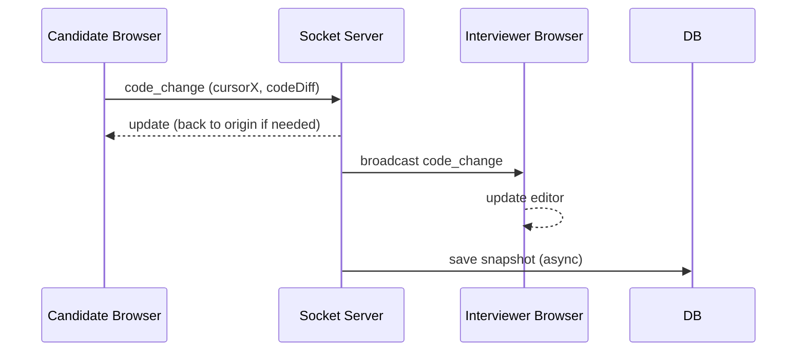

# Executive Summary  
Building a **PrepDost** AI-powered interview feature means creating a full-stack real-time platform combining video conferencing, collaborative coding, and AI assistance. The system must support live DSA and project-based interviews with roles for candidates, interviewers, observers, and admins. Success will be measured by usability (completion rates, satisfaction scores【8†L95-L103】), performance (low latency, high availability with SLO/SLA targets【10†L9-L17】), and business outcomes (time-to-hire improvements, dropout rates【8†L95-L103】).  

We recommend a modern tech stack: a React/TypeScript frontend (with **Monaco Editor**, **TLDraw** whiteboard, **KaTeX** for math, and **Framer Motion** for UI polish) and a Node.js or Python backend with **Socket.IO** for realtime events, **WebRTC** for video/audio, and **Redis + BullMQ** for async jobs (e.g. code execution, transcription).  The architecture will include REST APIs (sessions, auth, feedback) and WebSocket endpoints for code sync and signalling【21†L410-L418】. All interactions (code edits, whiteboard strokes) are synced via Socket.IO rooms, then persisted to a database (e.g. PostgreSQL)【21†L422-L428】. 

Key integrations are AI and media services: **OpenAI Whisper** or Google STT for speech transcription【12†L39-L47】, and LLMs (GPT-4, Google PaLM) for question generation and summarization.  Compliance needs include consent banners for recording (GDPR requires explicit informed consent【27†L78-L87】), role-based JWT auth, and encryption (TLS for data in transit). For scale, use Redis adapters for Socket.IO and a scalable media server or SFU (like Jitsi or Mediasoup) for multi-party WebRTC. Reliability will be engineered with retries (BullMQ backoff strategies【32†L153-L161】), health endpoints, and horizontal scaling. 

Testing plans should cover unit and integration tests (Jest, pytest), end-to-end flows (Cypress/Playwright), performance/load tests (Locust or Artillery), and even chaos testing. Accessibility (WCAG) will be baked in (e.g. Monaco’s screen-reader mode【35†L245-L253】, ARIA roles, keyboard nav). Observability with Prometheus/Grafana (the *four golden signals*: latency, traffic, errors, saturation【10†L9-L17】) and logging (Winston/Pino, structured logs) will allow early detection of issues. 

A mermaid diagram below shows the high-level architecture:

```mermaid
flowchart LR
    Browser["<b>Browser (Frontend)</b><br/>React/TSX UI with Monaco and TLDraw"]
    Browser -->|WebSocket (Socket.IO)| Server
    Browser -->|WebRTC (peer media)| SFU
    subgraph Server [Backend Layer]
      ServerAPI[Express/FastAPI REST API]
      ServerSocket[Socket.IO Server (Node/Python)]
      Judge[Code Runner Service<br/>(Docker containers)]
      Transcriber[ASR/TTS Service]
      AI[GPT/LLM Service]
      DB[(Postgres/NoSQL)]
      Redis[Redis Cache & BullMQ Queue]
      ServerAPI --> DB
      ServerSocket --> DB
      ServerSocket -->|dispatch jobs| Redis
      Redis --> Judge
      Redis --> Transcriber
      Redis --> AI
      Judge --> Redis
      Transcriber --> Redis
      AI --> Redis
    end
    SFU(MCU/SFU Server for Video)
    SFU -->|streams| Browser
    SFU -->|streams| Browser
    style Browser fill:#f9f,stroke:#333,stroke-width:1px
    style Server fill:#ffc,stroke:#333,stroke-width:1px
    style SFU fill:#ccf,stroke:#333,stroke-width:1px
```

## Goals & Success Metrics  
- **Realism and Engagement:** Simulate a real interview (video, audio, live coding, whiteboarding). Success = high **completion rate** (candidates finish interviews) and low **dropout rate**【8†L95-L103】.  
- **User Satisfaction:** Candidate and interviewer satisfaction ratings (NPS or surveys). Gather feedback to identify pain points【8†L130-L139】.  
- **Technical Reliability:** Set SLIs/SLOs (e.g. 95th percentile code-run latency, 99.9% uptime). Track error rates and response times (the four golden signals: latency, traffic, errors, saturation)【10†L9-L17】.  
- **Performance:** Page load <2s, editor edits propagation <100ms, video latency <300ms.  
- **Adoption & Outcomes:** Number of interviews conducted/month, time saved per interview (vs. email/text interviews), conversion (candidates hired via PrepDost). Track metrics like *time-to-fill* and *cost per hire* to show platform ROI【8†L87-L95】【8†L123-L131】.  
- **Security & Compliance:** Zero security incidents; GDPR compliance (explicit recording consent, data deletion policies).  

Key metrics include *interview completion rate* (percentage of started sessions finished) and *conversion rate* (completed interviews→hired)【8†L95-L103】. Regular reporting on these will drive iterative improvement.

## User Flows and Roles  
### Candidate  
1. **Pre-interview:** Sign in (via email/Social), complete profile, browse scheduled or available interviews, and upload relevant project details (repos, docs).  
2. **Lobby:** On interview start, enter a waiting room showing interviewer info, instructions (helpful tips), and a “Join” button for video/coding. Options for audio test and tutorial popover.  
3. **During Interview:** See interviewer video; use code editor (Monaco) for coding problems; a shared whiteboard (canvas) toggle for diagrams; text chat for messages; controls for microphone/camera. Timestamps or timer visible.  
4. **Post-interview:** Answer MCQs or feedback questions; receive automated transcript and summary; view performance dashboard.  

### Interviewer  
1. **Setup:** Log in; create or select an interview session; choose question set or let AI pick; invite candidate (email link); set time or start immediately. Optionally add an *observer*.  
2. **Pre-call:** Ensure camera/mic are working; possibly view coding question prior; schedule in calendar.  
3. **Lobby:** Join early, see candidate arrival; prepare notes/questions.  
4. **During Interview:** View candidate’s video; code editor where both can type; real-time metrics (time used). Use whiteboard to illustrate system design; mark candidate’s answers; send hints or launch next challenge.  
5. **Post-interview:** Fill evaluation rubric (skills, confidence); attach notes. Review AI-generated performance insights.  

### Observer (optional)  
- Can join as silent viewer: sees video, code editor, and chat in real time (no audio input). Useful for training or team interviews.  

### Admin  
- Manage users/permissions; define question banks and difficulty levels; configure system settings. Monitor overall platform usage (dashboards), health, and compliance logs.  



## UI/UX: Pages and Components  
- **Landing Page (Marketing):** Modern hero section, product intro, **PrepDost** branding (renamed), demo screenshots.  
- **Dashboard/Home:** For users post-login. Display metrics: upcoming interviews, practice stats, recommended tasks.  
- **Interview Lobby:** Video preview window (self-view), "Waiting for interviewer" message, start button. Option to view coding guidelines or problem statement before starting.  
- **Live Interview Page:** Split into resizable panels: 
  - *Top bar:* interview timer, problem title, question navigation, end session button.  
  - *Left panel (Code Editor):* Monaco editor with language selector, run/test buttons, output panel (compilation result). Buttons for “Save & Run”, “Submit”, “Reset to starter code”. Show hints/solutions toggles.  
  - *Middle panel (Video/Audio):* WebRTC video tiles (grid or focus mode: candidate larger). Mute/unmute and "raise hand" icons.  
  - *Right panel (Tools):* Tabs for Whiteboard (canvas drawing, TLDraw), Chat/Notes, and Participant list. In Whiteboard, tools (draw, eraser, text) and undo. Chat shows text messages and can trigger AI prompt.  
  - *Bottom bar:* Code execution logs and test results (expandable area).  

- **Code Editor Page (practice mode):** Similar to Live Interview but without video. Includes problem list side panel or tabs, test cases on/off (sample vs hidden), time/memory limits UI, and submission history table.  

- **Whiteboard:** Accessible within interview UI (modal or side). Must be easy to use with mouse/draw; should integrate image upload (e.g. architecture diagrams), and save strokes to DB for replay.  

- **Transcript:** After the session, show the complete speech transcript (as text), speaker-separated, with timestamps. Allow search within transcript. Highlight key answers/questions (via AI).  

- **Summary/Report:** Post-session screen with candidate scores, strengths/weaknesses (e.g. “Good at recursion, needs work on system design”), and AI-generated feedback (e.g. “Your code was clean but missed edge-case X.”). Include charts (bar for topics coverage, line for progress over time). Allow exporting PDF or sharing link.  

- **Auth Pages (Login/Signup):** Modern split-screen design (illustration + form), social login placeholders, clear privacy consent checkboxes. Provide success/error modals.  

- **General UI:** Use TailwindCSS for styling. Consistent header/navigation, dark/light theme toggle. Smooth Framer Motion animations (page transitions, fade-ins for new code lines). 

<div align="center">**Example: Live Interview Layout**</div>  
  
*(Illustrative mockup: panel layout with code editor, video and tools in one screen)*  

## Frontend Tech & Components  
- **Framework:** React (with TypeScript TSX) and Vite for fast builds. React Router for navigation.  
- **Styling:** TailwindCSS + component library (e.g. Shadcn UI or Radix) for consistent UI. Use CSS variables for brand colors.  
- **Editor:** **Monaco Editor** (same engine as VSCode) for coding. It has built-in multi-language support, themes, and accessibility features (keyboard navigation, screen-reader support【35†L208-L216】【35†L245-L253】). Will wrap in a React component.  
- **Whiteboard:** TLDraw (open-source whiteboard) or Fabric.js for canvas drawing. Provide shape tools, freehand, text. Persist strokes via WebSocket.  
- **Math rendering:** **KaTeX** for any math formulas in questions or whiteboard. Fast, SSR-compatible【39†L19-L27】.  
- **UI Animations:** Framer Motion for transitions (fade, slide, and subtle hover effects).  
- **Real-time & Comms:** **Socket.IO** client for syncing code, cursor positions, chat messages【21†L430-L438】. **WebRTC** (via simple-peer or PeerJS, or a library like Daily.co or Jitsi Meet) for video/audio streams【25†L200-L208】. Use a TURN/STUN server or hosted SFU (e.g. Twilio, Janus) to handle NAT traversal and multi-party.  
- **Other Components:** Toast notifications (react-toastify), modals (headlessui/react-dialog or Radix), avatars (Gravatar or custom). Use hooks for state management. Use `react-query` or `SWR` for server data (sessions, user).  

**Example Tech Stack:**

| Layer        | Technology                                               |
|--------------|----------------------------------------------------------|
| **UI Framework** | React, TypeScript, Vite                             |
| **Styling**  | TailwindCSS, CSS Modules, Shadcn UI (Radix)              |
| **Editor**   | Monaco Editor (with extensions for Python, C++, etc)     |
| **Whiteboard** | TLDraw or Fabric.js with React integration            |
| **Realtime** | Socket.IO (JS)                                          |
| **Video/Audio** | WebRTC (SimplePeer/Jitsi/Daily)                      |
| **State Mgmt** | React Query / Redux (optional)                        |
| **Data Visualization** | Chart.js, D3.js, or Recharts for graphs       |
| **Animation** | Framer Motion                                         |

This modern stack (React+TS, Tailwind, real-time libs) aligns with examples like DevInterview.io【19†L352-L360】.

## Backend Architecture  
- **API Layer (Node.js/Express or FastAPI):** Provides REST endpoints for authentication (`/auth/login`), session creation (`/sessions`), question bank, feedback submission, analytics. Use OpenAPI/Swagger for docs.  
- **WebSocket Server:** Socket.IO hub for real-time events: *code_update*, *cursor_move*, *whiteboard_draw*, *chat_message*, and WebRTC signalling (offer/answer). It will broadcast events to participants in the same interview “room”【21†L432-L438】.  
- **Code Judge Service:** A separate service or containerized worker (could use Docker, or a third-party sandbox API) to compile/run submitted code securely (for multiple languages). Queue jobs via BullMQ/Redis. Enforce CPU/memory/time limits, capture stdout/stderr, and push results back. Use containers like [openai/whisper] (just example name) for sandboxed execution.  
- **Recording Service:** If recording video/audio, route WebRTC streams to a recorder (SFU with recording, or use third-party like Twilio Record). Audio goes to transcription job.  
- **Transcription Service:** Once audio is saved, use Whisper (self-hosted model) or cloud STT (Google Cloud Speech-to-Text) to generate a transcript. Store transcript text with timestamps. Whisper is open-source (trained on 680k hours) and very accurate【12†L39-L47】. Use Whisper via Python (local or container) or via OpenAI API ($0.006/min as per 2026 pricing【14†L377-L384】).  
- **AI Services:** Calls to GPT-4 (or Google Bard) for question generation and interview summary. E.g. a prompt to generate DSA questions or follow-ups. Keep these off critical path (as asynchronous tasks).  
- **Database:** Store Users, Sessions, Submissions, Questions, Feedback. Use a relational DB (Postgres) for structured queries. Session schema example below. Use an ORM (Prisma, Sequelize, or SQLAlchemy) for migrations.  
- **Redis & Queues:** Use Redis for session caching (active room participant lists) and as the backend for BullMQ job queues. Each code-run, transcription, or AI summary is a job with retries/backoff【32†L153-L161】. Failed jobs go to a dead-letter queue for manual review. Monitor queue sizes and job latencies.  
- **Auth:** JWT-based auth tokens, with short lifetimes and refresh tokens. Roles encoded in token (candidate, interviewer, observer, admin). Middleware enforces role restrictions on API routes.  
- **Logging:** Centralised logs (JSON) via Winston or Pino. Each request/Socket event logs user ID, session ID, timestamp. Error logs captured with stack traces.  
- **Session Storage:** Persist code and whiteboard snapshots periodically (on every significant change or on disconnect) in DB【21†L432-L438】 to allow reconnections. Cleanup old sessions after X days.  

A mermaid sequence example for live code sync:


## Data Models (Schema Examples)  
Using a relational DB (PostgreSQL) with tables:  

**Users:** (id, name, email, role, hashed_password, avatar_url, created_at)  

**Questions:** (id, title, descriptionMarkdown, difficulty, tags, sampleInput, sampleOutput, solutionCode, created_by)  

**Sessions:** (id, interviewer_id, candidate_id, question_ids[], start_time, end_time, status, recording_url, transcript_id)  

**Submissions:** (id, session_id, user_id, code, language, result (pass/fail), runtime_ms, memory_kb, timestamp)  

**WhiteboardStrokes:** (id, session_id, user_id, data (SVG/JSON), timestamp)  

**Transcripts:** (id, session_id, text, speaker_labels, created_at)  

**Feedback:** (id, session_id, interviewer_id, candidate_id, score_total, notes, strength_areas, improvement_areas)  

A **Sessions** table might look like:

| Column          | Type         | Description                          |
|-----------------|--------------|--------------------------------------|
| id (PK)         | SERIAL       | Unique session ID                    |
| interviewer_id  | INT (FK)     | User ID of interviewer               |
| candidate_id    | INT (FK)     | User ID of candidate                 |
| question_ids    | INT[]        | List of Question IDs used            |
| status          | ENUM         | `pending`,`live`,`completed`,`cancelled` |
| start_time      | TIMESTAMP    | When interview started               |
| end_time        | TIMESTAMP    | When ended                           |
| recording_url   | TEXT         | Video recording file location        |
| transcript_id   | INT (FK)     | ID linking to Transcripts table      |

These schemas ensure all data (code snapshots, answers, feedback) is persisted for analytics and replays.

## Integrations & AI  
- **Speech-to-Text:** Use **OpenAI Whisper** (open-source) for offline transcription【12†L39-L47】. If low-latency needed, also offer live ASR with Google Cloud STT or AssemblyAI for streaming. AssemblyAI claims high accuracy and features like punctuation【14†L409-L418】. Whisper supports 99 languages and can run locally (10GB VRAM, slower than real-time)【14†L367-L375】. For simplicity, a Whisper API ($0.006/min) may suffice.  
- **Text-to-Speech (TTS):** To play back hints or questions, integrate Google or AWS Polly. Allow interviewer to type notes that candidate can listen to (accessibility).  
- **Language Models:** GPT-4 or Claude for:
  - **Question Generation:** E.g. prompt "Generate a medium-difficulty coding question about trees, plus three follow-up sub-questions on time complexity and edge-cases."  
  - **Interview Chatbot:** An AI assistant can interject suggestions or real-time hints to candidate if enabled (opt-in).  
  - **Summarization:** After session, send transcript and code to GPT for summary: "Summarize the candidate's strengths and weaknesses from this interview transcript."  
  - **Answer Analysis:** Optionally use AI to auto-grade or critique the submitted solution.  
- **Authentication:** Support OAuth (Google, GitHub) for convenience. Use tokens or SSO for enterprise.  
- **Storage:** Video and audio recordings stored in S3 (or GCS/Azure) bucket. Transcripts and code can also be backed up there for audits.  
- **Calendar/Email:** Integrate with Outlook/Google Calendar for scheduling, and email notifications with session links.  

**Example AI prompt for interviewer:**  

```text
You are an AI coding interviewer. Generate a medium-difficulty Data Structures and Algorithms question for an interview, including:
- A clear problem statement.
- Three follow-up questions about edge cases or optimizations.
- After writing the question, format 2-3 bullet hints to guide the candidate.

Question domain: Graphs (e.g., find the shortest path, detect cycles).
```

This is a sample “system prompt” one could feed to GPT-4 to generate content.

## Security & Privacy  
- **Authentication & Authorization:** All API calls require a valid JWT (stored in httpOnly cookie or Authorization header). Implement role-based access control (RBAC) on routes: e.g. only interviewer/admin can start sessions or view other transcripts. Use strong password hashing (bcrypt) and consider 2FA for interviewers/admins.  
- **Data Encryption:** TLS (HTTPS/WSS) everywhere. Encrypt sensitive data at rest (database credentials, user info). Store keys in a secrets manager.  
- **GDPR & Consent:** Explicitly request consent before recording video/audio【27†L78-L87】. Provide an on-screen banner: “This interview will be recorded for training and evaluation purposes. Do you consent?” with an option to decline (in which case disable recording/transcription). Ensure data is deleted after a retention period or on user request. Comply with “right to be forgotten.”  
- **Audit Trail:** Log user actions (login, interview created/joined) for auditing. Secure logs (no PII in logs, or mask it).  
- **Rate Limiting & Abuse:** Rate-limit API endpoints (e.g. 100 req/min) and Socket events per user (prevent flooding chat/code). Use libraries like `express-rate-limit`.  
- **Input Validation:** Validate all inputs on the server (e.g. code submissions, text fields) to prevent injections. Use a whitelist of allowed file types for any uploads.  
- **Protect Code Execution:** Sandbox code runner (Docker container, restricted user). Limit execution time and memory. Scan for banned functions if necessary.  
- **Token Expiry:** Set short-lived JWTs (e.g. 1h) and refresh tokens; logout on password change or 2FA reset.  
- **Compliance:** Show privacy policy, terms. If users upload personal projects (as basis for questions), handle that data carefully (explicit opt-in to use it for question generation).  

## Reliability, Scaling & Operations  
- **Horizontal Scaling:** Run multiple instances of API/Socket servers behind a load balancer. Use **Redis Adapter** for Socket.IO so sessions work across instances【4†L111-L120】. Use container orchestration (Kubernetes or Docker Swarm).  
- **Queue Robustness:** Configure BullMQ with retry policies (exponential backoff) for failed jobs【32†L153-L161】. Monitor the queue and have alerts if worker count/backlog grows.  
- **Health Checks:** Provide `/healthz` endpoints for API and worker to check dependencies (DB, Redis). Use container orchestration to restart failing pods.  
- **Monitoring:** Use Prometheus to scrape metrics (via prom-client)【37†L179-L188】【37†L199-L203】. Key metrics: API request latencies, queue length, WebRTC packet loss, memory usage. Set alerts for high error rates or response time breaches. Consider an APM (Datadog, New Relic) for traces.  
- **Logging & Tracing:** Correlate logs with a request ID (X-Request-ID) across services. Use a centralized log system (ELK/Loki) to search by session_id.  
- **Database Scaling:** For high load, use read replicas for heavy reads (analytics), and a robust write host. Use connection pooling.  
- **Content Delivery:** Serve static assets (JS/CSS) via CDN. Optimize images and bundle.  

## Testing & QA Strategy  
- **Unit Tests:** For backend logic (API controllers, judge service) and frontend components (React components with Jest/Testing Library). Cover edge cases (e.g. code that never terminates).  
- **Integration Tests:** Simulate whole flows: using tools like Supertest (Node) or pytest. Test key API flows (auth, session create/join).  
- **End-to-End (E2E):** Automate with Cypress or Playwright: user logs in, starts interview, writes code, interviewer evaluates. Also test UI components (menu, modals).  
- **Load/Stress Testing:** Use k6 or Artillery to simulate many concurrent interviews (e.g. 100 interviews with 2 streams each) to measure WebRTC and server load. Ensure 95th percentile latency under target.  
- **Chaos/Resilience Testing:** Intentionally kill services (Redis, WebRTC server) to ensure graceful degradation and recovery.  
- **Accessibility Testing:** Use aXe or Lighthouse to check contrast, keyboard nav, and correct use of ARIA roles. Ensure Monaco editor’s accessibility mode is enabled when needed【35†L245-L253】.  
- **Security Testing:** Regularly run vulnerability scanners (npm audit, Snyk), and penetration tests focusing on auth flows.  
- **Continuous Testing:** Integrate tests into CI pipeline; enforce code coverage thresholds.  

## Accessibility & Performance  
- **WCAG Compliance:** Use semantic HTML and ARIA labels for all buttons/controls. Ensure color contrast and resizable text. Monaco has built-in screen-reader support and keyboard navigation (command palette)【35†L208-L216】【35†L245-L253】; ensure focus trapping is handled in modals.  
- **Keyboard Navigation:** All interactive elements reachable by Tab. Provide skip links and focus outlines.  
- **Performance Optimizations:** Bundle and minify JS/CSS (Vite does this). Lazy-load heavy components (e.g. WebRTC library only when call starts). Use React Profiler to find bottlenecks. Pre-render (SSR) the landing page or use client-side only React with careful code-splitting.  
- **Mobile & Responsive:** Layout adapts (e.g. collapsible side panels on small screens). Ensure the Monaco editor scales (or disable for tiny screens). Test on tablets.  
- **Loading States:** Show skeleton loaders for heavy parts (e.g. code editor loading, video connecting).  
- **Caching:** Use HTTP caching and ETags on static content. For dynamic data, use short-lived in-memory cache (Redis) for hot data (e.g. question bank).  

## UX Edge Cases & Failure Modes  
- **Candidate Loses Connection:** Detect disconnect; inform interviewer; allow rejoin (resume from last state). Use Socket.IO’s reconnection and server session recovery.  
- **Interviewer Aborts:** If interviewer leaves mid-session, hold candidate on-page with message, allow resume or end early. Optionally auto-assign another interviewer (if pool available).  
- **Slow Code Execution:** If code-run takes too long, terminate after limit, show “timeout”. Provide clear feedback (time exceeded).  
- **Recording Failures:** If video recording fails, log an alert but continue (no candidate impact). Notify admin for retry.  
- **Backend Errors:** Show user-friendly errors (e.g. “Something went wrong. Retrying…”). Global error handler on frontend to catch promise rejections.  
- **Full Room:** If a fourth participant tries to join a “2-person” session, block or move to waiting room (for observers only).  
- **Data Loss Prevention:** Autosave code continuously to avoid loss on crash. Ask before navigating away.  

## Deployment & CI/CD Checklist  
1. **CI:** On push to main, run lint, unit tests, and security scans.  
2. **Build:** Frontend built (Vite) and backend packaged (Docker).  
3. **Canary/Staging:** Deploy to staging environment. Run smoke tests (basic flows).  
4. **Data Migrations:** Script to apply DB schema changes safely (with downtime window or zero-downtime techniques).  
5. **Secrets & Config:** Ensure environment variables (DB URL, API keys) are set in production config store.  
6. **Containerization:** Dockerize services (use official images for Node, Python). Multi-stage build for smaller images.  
7. **Orchestration:** Use Kubernetes or a PaaS (Render, Heroku). Configure Horizontal Pod Autoscaler. Use tools like Helm or Terraform.  
8. **Rollback Plan:** Keep previous version container readily available. Use incremental deployments.  
9. **Post-deploy:** Run basic health checks. Smoke test APIs (`/health`).  

**CI/CD Pipeline:** GitHub Actions or GitLab CI to automate build/test/deploy. Code coverage and linting gates.  

## Observability & Monitoring  
- **Logging:** JSON logs with request/session context. Use a centralized log system (e.g. Loki or ELK). Capture key events (session start/end, errors).  
- **Metrics:** Expose `/metrics` (Prometheus) with default Node metrics plus custom ones (e.g. `http_requests_total`, `socket_events_total`, `queue_jobs_count`【37†L179-L188】). Instrument critical flows (code execution times, AI response times).  
- **Alerts:** Slack/email alerts on 5xx error spikes, high latency (API or DB), or WebRTC failures (stream disconnections). Watchdog for job queue backlogs.  
- **Dashboards:** Grafana charts for traffic, error rates, CPU/RAM, WebRTC packet stats. Daily/weekly summary of interview count and durations.  
- **Health Checks:** Use liveness/readiness probes. Monitor DB connections and Redis usage.  

## Implementation Roadmap  

| Milestone                             | Tasks (sample)                                     | Effort | Acceptance Criteria                                                                                 |
|---------------------------------------|----------------------------------------------------|--------|-----------------------------------------------------------------------------------------------------|
| **1. Setup & Foundations** (Small)    | - Initialize repo (Node/React) with eslint <br>- Auth scaffolding (login, JWT) <br>- Docker, CI pipeline <br>- Simple REST API and DB models | Small  | Repo with CI, README, linter passing; can register/login; DB migrations run.                         |
| **2. Code Editor & Sync** (Medium)   | - Integrate Monaco editor <br>- Implement Socket.IO code sync (rooms) <br>- Basic code-runner service (sandbox) <br>- Save code to DB on save event | Medium | Two users editing see each other’s changes in <50ms; code runs successfully and shows output.      |
| **3. Interview Session Flow** (Medium)| - Session creation endpoints <br>- Lobby UI (waiting room) <br>- Join session (assign roles) <br>- Implement role-based guards <br>- Session state persistence | Medium | Candidate/Interviewer can start interview: code editor + chat open; session record created in DB.   |
| **4. Video/Audio (WebRTC)** (Large)  | - Add WebRTC video (use STUN/TURN) <br>- UI for video tiles <br>- Handle permissions and fallback <br>- SFU for >=2 participants | Large | Real-time video and audio between interviewer & candidate works reliably (low latency, acceptable quality). |
| **5. Whiteboard & Chat** (Medium)     | - Integrate TLDraw canvas <br>- Sync drawings via Socket.IO <br>- Chat widget (store messages) <br>- Linking chat to transcript with time | Medium | Both participants can draw on shared canvas; chat messages appear instantly and persist.             |
| **6. Transcription** (Medium)        | - Capture audio stream or recording <br>- Setup Whisper or cloud STT API <br>- Post-session transcript display <br>- Consent prompt UI | Medium | Recorded audio produces a text transcript; user can view and search transcript post-interview.      |
| **7. AI Question Generator** (Small) | - Define prompt schema <br>- Call OpenAI API for questions <br>- Save generated question set <br>- Provide UI to “Get AI question” | Small  | Interviewer can click “Generate AI question”, and receive a new problem with sub-questions.         |
| **8. Summary & Analytics** (Medium)  | - Develop rubric scoring UI <br>- Call GPT for summary post-interview <br>- Build report page with charts <br>- Progress tracking | Medium | After session, user sees a summary page with scores, charts, and AI feedback.                       |
| **9. Security & Compliance** (Small) | - Implement recording consent banner <br>- Data encryption (HTTPS) <br>- Rate limiting middleware <br>- Privacy policy page | Small  | Interview start shows consent modal. TLS enforced. API rate limiting active.                        |
| **10. Polish & Deployment** (Medium) | - UI polishing, accessibility fixes <br>- Load testing & optimizations <br>- Setup monitoring/alerts <br>- Deploy to production cloud | Medium | Site meets performance SLIs; automated alerts configured; live URL with working CI/CD.            |

*Effort:* Small = 1–2 days, Medium = 1–2 weeks, Large = 1+ month.

Each milestone ends with defined criteria. For example, Milestone 4 passes when a candidate and interviewer on different machines can talk and see each other via the app.

By following this comprehensive plan—building on existing best practices【21†L386-L394】【23†L115-L123】 and focusing on reliability, usability, and security—we can deliver a polished, hackathon-grade interview feature for PrepDost that meets user needs and scales to thousands of users. Each component (editor, video, AI) is chosen from mature, industry-proven libraries (Monaco, WebRTC, Whisper) to ensure stability and performance.